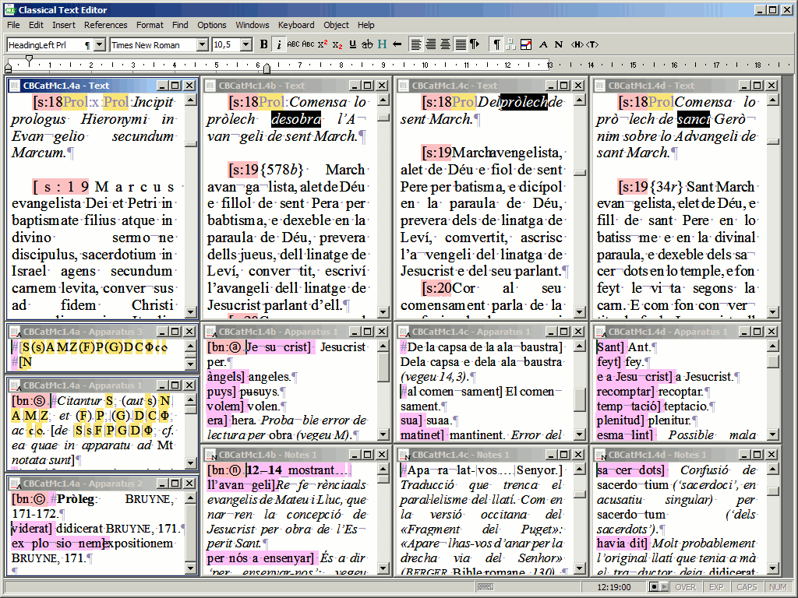
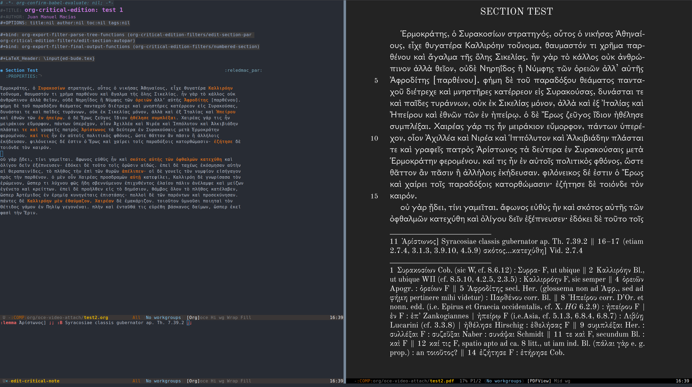
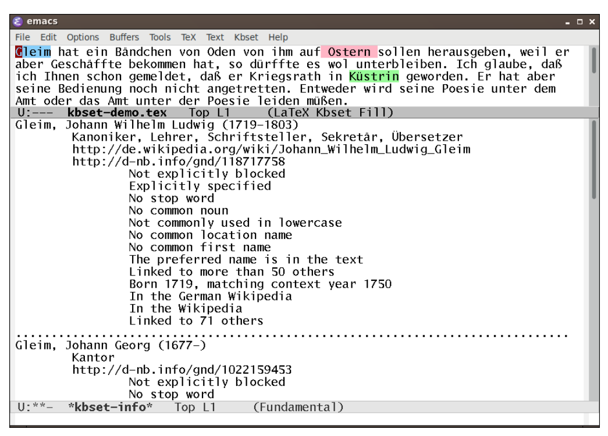
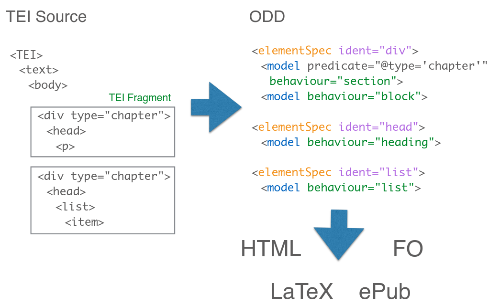
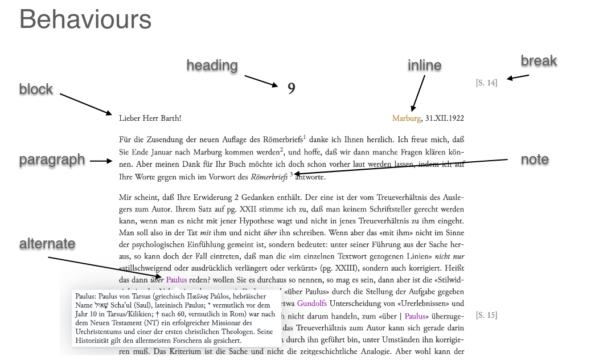
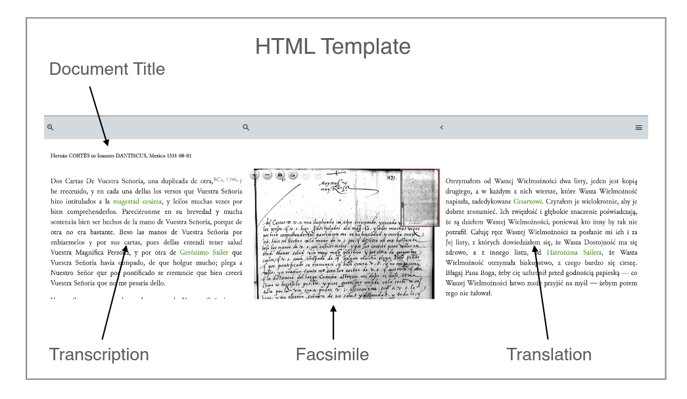

# Text Technologies for Historical Disciplines, Scholarly Editions (TEI-XML)

## Basics

<div id="basics" style="max-width:870px;">
  <p style="float: left;">Conférence Universitaire de Suisse Occidental (CUSO)</p>
  <p style="float: right;">05.05.2023</p>
  <div style="clear: both;"></div>
  <p style="float: left;">UniL, salle 315.1 (Amphipôle Lausanne)</p>
<div style="clear: both;"></div>
<p style="float: left;">Repository: [https://github.com/DominicWeber/CUSO_UNIL](https://github.com/DominicWeber/CUSO_UNIL)</p>
  <p style="float: right;"><a rel="license" href="http://creativecommons.org/licenses/by/4.0/"></a></p>
  <div style="clear: both;"><br/><br/></div>
  <p style="float: left;">*Peter Dängeli, University of Bern (DH, Data Science Lab)*</p>
  <p style="float: right;">*peter.daengeli@unibe.ch*</p>
  <div style="clear: both;"></div>
  
</div>


<!-- 
less technical/mathematical than yesterday

--> 

## Schedule
* Insights 1: Text Recognition (based on Transkribus)
* Insights 2: Named Entity Recognition, Part-of-Speech and Outlook
* **Insights 3: Scholarly Editions (TEI-XML)**

---

## Digital Scholarly Editions (DSE)

<!--
Making cultural (textual) artefacts accessible

* Content/structure: 
    * transcriptions
    * translations
    * annotation/commentary
    * linking, reference systems
    * Synopsis

* methodical/technical:
    * text rendering
    * search
    * linking, navigation
    * interfaces
    * visualisations
-->

---

### Editing sources

```
        +---------------+ +---------------+ +---------------+ +---------------+
         \               \ \               \ \               \ \               \
          \               \ \               \ \   Editorial   \ \               \
           \  Selection    \ \  Preparation  \ \    core       \ \  Publication  \
           /               / /               / /  business     / /               /
          /               / /               / /               / /               /
         /               / /               / /               / /               /
        +---------------+ +---------------+ +---------------+ +---------------+
```

Any of these steps may be influenced by the use of digital approaches.

What about the process as a whole? Does it become more cyclical or pluggable?

<!--
core tasks:
    * transcriptio (base text) 
    * collatio (textual variance) 
    * recensio (stemma) 
    * selectio (authoritative reading / app. crit.) 
    * emendatio (amend the original; defer original reading to app. crit.)
-->

---

### How digital do we want it?

To what extent are digital editions re-mediated print editions?

```
            the print mind  <---------------------------->  the digital mind
``` 

How close do we want to stay to the typographical setting and to perusing conventions of printed editions?

Do we create editions only for human eyes? 

Does a digital edition even need a (graphical) interface?

"The print mind is (unsurprisingly) tenacious." Toma Tasovac, recent talk at the Austrian Centre for DH, [https://youtu.be/2tpFr8VL6PM](youtu.be/2tpFr8VL6PM) (04.05.2023)

<!-- 
"print mind" in general:
* linearity, sequentiality
* sustained focus, richness of detail
* long-term memory, information retention
* analytical thinking

"print mind" from a DH angle:
* sociotechnical principles that affect engagement with texts, such as
	* conceptualising digital editions
	* building interfaces
	* creating corpora
	* maintaining metadata

"digital texts"/"electronic textuality"
* non-identical to itself
* multi-layered, almost infinitely transformable (and annotatable)
* by definition fluid, volatile, incomplete

a possible goal:
* programmable digital editions
* texts not as objects, but as services, suited for interactive use
-->

---

## The Text Encoding Initiative (TEI)

<div>
<div style="display:inline-block; width:300px; margin-right:50px;">

</div>
<div style="display:inline-block; width:450px; vertical-align:top;">
</div>

* Core delivery: encoding guidelines
* "Standard" for digital research with and on texts
* Targets the semantical description of texts, not the implementation of a graphical interface
* Open source
* Community based
* Multilingual
* Possible presentation forms / renderings: CD ROM, PDF, HTML, API, XML?

### History of the TEI


```
1987 Begin of a standardisation effort (by ACH / ACL / ALLC)
│  13.11.1987: TEI PCP1 "CLOSING STATEMENT OF THE VASSAR PLANNING CONFERENCE"
│
└── 1990 ❰ P1 ❱  
  │   07.1990: first public proposal "Guidelines for the Encoding and Interchange 
  │            of Machine-Readable Texts" (Ed. M. Sperberg-McQueen, L. Burnard)
  │
  └── 1992 ❰ P2 ❱  Development (four Working Committees and various WGs)       
    │
    └── 1994 and 1999 ❰ P3 ❱ "Guidelines for Electronic Text Encoding and Interchange"
      │                      439 elements, 1292 pages; considered achievement of the goals of 1987
      │
      └── 1999 / 2000 TEI Consortium (TEIC)
        │
        └── 2002 ❰ P4 ❱ 441 elements; SGML, XML (neu); retaining backwards compatibility
          │ initial goal: to rectify mistakes; outcome: identification of new potentials
          │
          └── 2007 ❰ P5 ❱ reorganisation and revision; no (full) compatibility to P4
                          ongoing development, laufende Fortentwicklung, zuletzt 04.04.2023: TEI P5 4.6.0
```


```
  TEI proposals
    └── 1990 ❰ P1 ❱           DOI: 10.5281/zenodo.3459203
      └── 1992 ❰ P2 ❱         DOI: 10.5281/zenodo.3459221     
        └── 1994 ❰ P3 ❱       DOI: 10.5281/zenodo.3549598
          └── 2002 ❰ P4 ❱     DOI: 10.5281/zenodo.3549616
            └── 2007 ❰ P5 ❱   DOI: 10.5281/zenodo.5347789
``` 

* Recommended reading: Lou Burnard (2014), What is the Text Encoding Initiative? https://books.openedition.org/oep/426

---

## Editing TEI files

* plain text format (XML), may be edited in any text editor
* oXygen XML Editor (proprietary), most feature-rich editor with a lot of built-in TEI specific functionality
* TEI plugins exist for a number of other tools
* Classical Text Editor (CTE)<br/>
Offers export to TEI<br/><br/>
<div>
<div style="display:inline-block; width:700px; margin-right:50px;">

</div>
<div style="display:inline-block; width:450px; vertical-align:top;">
</div>
* command line editors
	* Emacs org mode (by Juan Manuel Macías)<br/>
Screencast: [https://lunotipia.juanmanuelmacias.com/images/org-critical-edition.mp4](https://lunotipia.juanmanuelmacias.com/images/org-critical-edition.mp4)<br/>
Repository: [https://gitlab.com/maciaschain/org-critical-edition
](https://gitlab.com/maciaschain/org-critical-edition
)<br/><br/>
<div>
<div style="display:inline-block; width:700px; margin-right:50px;">

</div>
<div style="display:inline-block; width:450px; vertical-align:top;">
</div>
	* KBSET Environment *Knowledge-Based Support for Scholarly Editing and Text Processing* (Christoph Wernhard, Sulzer edition; written in SWI Prolog)<br/>
  [http://cs.christophwernhard.com/kbset/](http://cs.christophwernhard.com/kbset/)<br/><br/>
  <div>
  <div style="display:inline-block; width:700px; margin-right:50px;">
  
  </div>
  <div style="display:inline-block; width:450px; vertical-align:top;">
  </div>

---

## Presentation, some approaches

### Approaches: (La)TeX 

<span>L<span style="text-transform: uppercase;
  font-size: 0.75em;
  vertical-align: 0.28em;
  margin-left: -0.38em;
  margin-right: -0.15em;
  line-height: 1ex;">a</span>T<span style="text-transform: uppercase;
  vertical-align: -0.5ex;
  margin-left: -0.1667em;
  margin-right: -0.125em;
  line-height: 1ex;">e</span>X</span>

* The expert was (still is?) just around the corner: Maïeul Rouquette, Institut romand des sciences bibliques IRSB
	* Maintainer of relevant packages `reledmac`, `reledpar` <!-- predecessors: `ledpar`, `ledmac`, `eledpar`, `eledmac`, before that TeX `EDMAC`, `TABMAC` and `EDSTANZA` -->
* From `XML-TEI` to `reledmac`: cf. Annexe B of the `reledmac` handbook

---

### Approaches: In-browser transformation

* TEI Boilerplate (dated, but functional), [https://dcl.ils.indiana.edu/teibp/](https://dcl.ils.indiana.edu/teibp/)
* Till Grallert is using this approach to publish (functionally) simple arabic editions
	* Code: [https://github.com/OpenArabicPE/tei-boilerplate-arabic-editions](https://github.com/OpenArabicPE/tei-boilerplate-arabic-editions)
	* Example: [https://github.com/OpenArabicPE/journal_al-muqtabas](https://github.com/OpenArabicPE/journal_al-muqtabas) / [https://openarabicpe.github.io/journal_al-muqtabas/tei/oclc_4770057679-i_1.TEIP5.xml](https://openarabicpe.github.io/journal_al-muqtabas/tei/oclc_4770057679-i_1.TEIP5.xml)

---

### Approaches: Pipeline-based

* Applications: Apache Cocoon (dated), Kiln (also), XSLWeb
	* Principle: interpret URL/request, then invoke transformation pipeline that generates the output
* More modern: Continuous integration, coupling version control of data/applications and auto-building and deploying to a server
* Also think of the pipeline developed by Violeta Seretan (editorial workflow, pre-publication): <br/>
Seretan, Violeta (2020). **Digital Critical Edition of Apocryphal Literature: Sharing the Pipeline.** In Sharing the Experience: Workflows for the Digital Humanities. Proceedings of the DARIAH-CH Workshop , Neuchâtel. Neuchâtel: UNINE; SIB; DARIAH.
[urn:nbn:ch:serval-BIB_C8802C82FDDF3](https://nbn-resolving.org/urn:nbn:ch:serval-BIB_C8802C82FDDF3)

---

### Approaches: ODD-based

The model underlying the TEI Guidelines is itself specified using mechanisms defined in it. Specifically, it is based on the ***One document does it all*** approach devised by the TEI core developers. 

At the core of ODD lies the TEI Processing Model, a declarative way to formalise input-output relations. For instance, the TEI Guidelines are generated using this mechanism (as PDF files, HTML pages and schema files for validation purposes.

In recent years, the ODD/Processing Model approach was enhanced to facilitate the transformation of TEI XML documents to HTML renderings. 

Among the driving forces behind this development are the developers of the TEI Publisher, the publishing tool with the tagline "The Instant Publishing Toolbox".

Background information:

* "TEI Simple Processing Model Specification" (Rahtz, S., Mueller, M., Pytlik-Zillig, B., Turska, M., Cummings, J. 2015)
* "TEI Processing Model Toolbox" (Meier, W. and Turska, M. 2015-2016 – in conjunction with eXist-db v2.3)
* "TEI Publisher" since 2017, https://teipublisher.com
* Section 22.5.4.1 of the TEI Guidelines, the official specification of the TEI Processing Model: [https://www.tei-c.org/release/doc/tei-p5-doc/en/html/TD.html#TDPMPM](https://www.tei-c.org/release/doc/tei-p5-doc/en/html/TD.html#TDPMPM)

---

#### TEI Publisher

* Bundled setup: eXist-db (native XML database), TEI Publisher (eXist app), pb-components (web components; presentational rendering)
* Other setups are possible, e.g. embedding components in another frontend framework
* Geared towards non-programmers
	* many adjustments possible in the graphical user interface (browser-based)
	* the goal is to allow more/all configuration to be done this way
* Since version 7 TEI Publisher comprises an annotation environment; more and improved workflow assistance is planned (e.g. for named entity recognition, using machine-learning approaches)
* Note that the tool development is backed by the association e-editiones (founded three years and one day ago), which unites a number of individuals and groups working on digital editions in Switzerland and elsewhere.
* Community mailing list ([https://admin.hostpoint.ch/mailman/listinfo/community_e-editiones.org](https://admin.hostpoint.ch/mailman/listinfo/community_e-editiones.org)) and Slack channel ([https://join.slack.com/t/e-editiones/shared_invite/zt-e19jc03q-OFaVni~_lh6emSHen6pswg](https://join.slack.com/t/e-editiones/shared_invite/zt-e19jc03q-OFaVni~_lh6emSHen6pswg))

---

#### TEI Publisher, Demonstration

##### TEIPublisher samples

Currently, 21 samples are available at [https://teipublisher.com/exist/apps/tei-publisher/index.html?query=&collection=test](https://teipublisher.com/exist/apps/tei-publisher/index.html?query=&collection=test&sort=title&field=text&start=1), at different levels of sophistication.

This database-like view also illustrates a central feature of the tool, specifically the faceted search on the left. Many editions use a view like this to access edited documents.

<details><summary>Hernán CORTÉS to Ioannes DANTISCUS, Madrid [1529]-09-11 </summary>

<br/>

Synoptical view of a letter in Spanish and Polish with annotated entities. Interactive highlighting of corresponding sentences. 

Two modes are available (through a checkbox in the navigation bar): a normalised view and a plain reading view.

[https://teipublisher.com/exist/apps/tei-publisher/test/cortes_to_dantiscus.xml?view=page&p_norm=on&p_highlight=off&odd=dantiscus&root=2.5.2.2.6.3.7.3.5&selectors=%5Bobject+Object%5D%2C%5Bobject+Object%5D](https://teipublisher.com/exist/apps/tei-publisher/test/cortes_to_dantiscus.xml?view=page&p_norm=on&p_highlight=off&odd=dantiscus&root=2.5.2.2.6.3.7.3.5&selectors=%5Bobject+Object%5D%2C%5Bobject+Object%5D)

<br/>

</details>


<details><summary>Letter #6 from Robert Graves to William Graves (at Oundle School) November 15, 1957</summary>

<br/>

Transcription of a letter (including two postscripts) with interactive map view as well as content information on referenced persons, locations, etc. 

[https://teipublisher.com/exist/apps/tei-publisher/test/graves6.xml?view=div&odd=graves](https://teipublisher.com/exist/apps/tei-publisher/test/graves6.xml?view=div&odd=graves)

<br/>

</details>

<details><summary>Das italienische Madrigal</summary>

<br/>

Short snippet showcasing the inclusion of a MEI encoding (Music Encoding Initiative) in a TEI encoding. 

The excerpted sheet music is available in audio form.

[https://teipublisher.com/exist/apps/tei-publisher/test/pb-mei-app.xml](https://teipublisher.com/exist/apps/tei-publisher/test/pb-mei-app.xml)

<br/>

</details>

<details><summary>Cossacks by Marko Vovchok / Maria Vilinskа</summary>

<br/>

Bare text presentation in Ukrainian variation of Cyrillic script: [https://teipublisher.com/exist/apps/tei-publisher/test/UKR18583_VovchokKozachka.xml](https://teipublisher.com/exist/apps/tei-publisher/test/UKR18583_VovchokKozachka.xml)

<br/>

</details>


##### teipublisher.info samples

The following examples are chosen to demonstrate non-western scripts and RTL languages. With thanks to their lead developer **Gil Shalit**, who has a lot of experience with TEI Publisher and is happy to answer questions or offer consulting (via https://www.dh-dev.com/#Contact, https://twitter.com/DH_Development, or https://twitter.com/GilShalit). 

<details><summary>Dybbuk</summary>

<br/>

[Der-Dybbuk](https://teipublisher.info/exist/apps/Dybbuk/index.html)  starts from three versions of a Yiddish play from the beginning of the 20th century and will assist in the synthesis of a new version which will be performed on stage.

Workflow:

* OCR processing of the hand-written notebooks
* transformation to TEI
* annotated in the TEI-Publisher's annotation workspace

Examples:

* Synoptic edition view (synchronisation by scene; in each scene page, hovering over &lt;sp&gt; elements synchronizes the dialog): [https://teipublisher.info/exist/apps/Dybbuk/Synoptic/SynopticEdition.xml](https://teipublisher.info/exist/apps/Dybbuk/Synoptic/SynopticEdition.xml)
* Annotation LTR (German): [https://teipublisher.info/exist/apps/Dybbuk/PlaysLTR-A/DIBBUK408.xml?tab=0&root=1.4.4.4](https://teipublisher.info/exist/apps/Dybbuk/PlaysLTR-A/DIBBUK408.xml?tab=0&root=1.4.4.4)
* Annotation RTL (Hebrew): [https://teipublisher.info/exist/apps/Dybbuk/PlaysRTL-A/C-Expanded-2023-1-16.xml?tab=0](https://teipublisher.info/exist/apps/Dybbuk/PlaysRTL-A/C-Expanded-2023-1-16.xml?tab=0)

</details>

<details><summary>TraveLab</summary>

<br/>
Trilingual edition of the Journey of Benjamin of Tudela, a 12th century Jewish traveller.

Workflow:

* modelling
* digitization
* geo-referencing
* alignment of three versions (using [XMLPlanter](https://github.com/GilShalit/XmlPlanter))
* interactive map functionalities (by extending the pb-leaflet-map’s functionality with Javascript hooks)

Examples:

* main view (columnar trilingual comparative view with integrated map): [https://teipublisher.info/exist/apps/TraveLab/Benjamin%20of%20Tudela.xml](https://teipublisher.info/exist/apps/TraveLab/Benjamin%20of%20Tudela.xml)

</details>

---

#### TEI Publisher, Demonstration: How does it work?

Three elements are at play:

* data (TEI files)
* templates
* processing instructions, formalised in an ODD file

From these the TEI Publisher generates the various views including functionalities such as linking, tooltips, highlighting, etc.

<br/>



---



---



---

#### TEI Publisher, Demonstration: Let's try

* We create a new ODD from the playground view ([https://teipublisher.com/exist/apps/tei-publisher/index.html?language=en-US&query=&collection=playground](https://teipublisher.com/exist/apps/tei-publisher/index.html?language=en-US&query=&collection=playground)).
* Upload a TEI document or select an existing one in the playground (you may inspect its contents through the right menu icon, "VIEW TEI XML").
* Set your ODD as the document's ODD (again through the right menu icon; if it is not available, try refreshing).
* Open the visual ODD editor through the Admin menu (it is set to open in a new tab), then try to add or change some transformation rules and save the ODD (disk icon).
* Regenerate the transcription view (arrow icon) and check the result. It is often needed to reload the page.

Relevant chapter in the TEI Publisher Documentation: [https://teipublisher.com/exist/apps/tei-publisher/doc/documentation.xml?odd=docbook&view=div#odd-customization](https://teipublisher.com/exist/apps/tei-publisher/doc/documentation.xml?odd=docbook&view=div#odd-customization)

---

#### TEI Publisher, Pros and Cons

➕

* widespread, good community uptake
* serves basic use cases very well
* capable search tools available
* offers a number of functionally different examples to build upon
* encompassing documentation
* aware of sustainability issues (and tackling some of them)
* generally good grasp of the needs of SDEs
* friendly community (but only few experts)

➖

* somewhat opinionated
* relatively complex setup (but there is a helpful shortcut)
* bumpy learning curve for more specific functional requirements
* poor fit in pipeline setup (data access, version control)
* many and different development goals put core developers under pressure
* considerable resource footprint
* specification work (processing model) happens in only one workshop<sup>1</sup> 

<div style="font-size:small;">
<sup>1</sup> Generally, at least two independent and interoperable implementations are desirable for sound specification work. To quote a high-ranking example: "In general, an Internet Standard is a specification that […] has multiple, independent, and interoperable implementations with substantial operational experience" -- The Internet Standards Process -- Revision 3, https://datatracker.ietf.org/doc/html/rfc2026).
</div>

---

## Part II

### Hands on: TEI Publisher

* Explore some samples available at https://teipublisher.com/exist/apps/tei-publisher/index.html?collection=test or https://teipublisher.info/exist/apps/dashboard/index.html (Dybbuk, TraveLab, Sand and Stars).

* Create your own ODD and upload or choose a document from the playground, then try to apply some changes.
	* Playground: [https://teipublisher.com/exist/apps/tei-publisher/index.html?query=&collection=playground](https://teipublisher.com/exist/apps/tei-publisher/index.html?query=&collection=playground)

  Login information: 

	  user:      tei-demo
	  password:  demo

* If you want to dive deep after the course: [https://github.com/eeditiones/workshop](https://github.com/eeditiones/workshop) (3 video presentations, slides, assignments).

---

## Part III 

### Synthesis, discussion


<!--
> Regarding rtl languages, there is no problem as long as text uses Unicode encoding. Making the ui play nice with rtl requires some minor changes to templates and css, nothing too challenging.
-->

---

<!--
<br/><br/><br/><br/><br/><br/><br/><br/><br/><br/><br/><br/><br/><br/><br/><br/><br/>
*spurious notes*

### Approaches: 

ENLAC (Editer la littérature apocryphe chrétienne)

Pipeline (editorial workflow, pre-publication)

general approach: transcription > tokenisation > normalisation > alignment > analysis > edition
`tpen2tei`

```
tpen2tei            tokenisation, normalisation   +---+
                                                      |
   |                                                  |
   |                                                  |
   v                                                  |  =>  Pipeline, Docker-based
                                                      |
CollateX            alignment                         |      basis for the editorial
   |                                                  |      work and the creation
   |                                                  |      of the actual edition
   |                                                  |
   v                                                  |
                                                      |
Stemmaweb/-rest     analysis + storage            +---+


? ? ?               digital publication

```

SERETAN, Violeta (2020). **Digital Critical Edition of Apocryphal Literature: Sharing the Pipeline.** In Sharing the Experience: Workflows for the Digital Humanities. Proceedings of the DARIAH-CH Workshop , Neuchâtel. Neuchâtel: UNINE; SIB; DARIAH.
[urn:nbn:ch:serval-BIB_C8802C82FDDF3](https://nbn-resolving.org/urn:nbn:ch:serval-BIB_C8802C82FDDF3) -->


